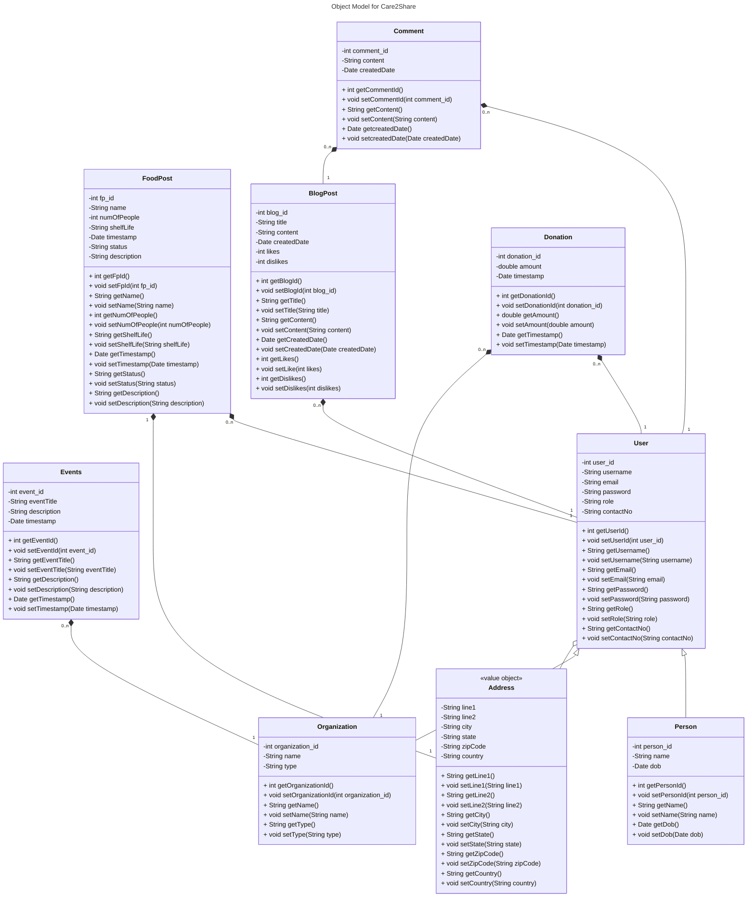

# Care2Share
## Overview:

## Key Features:
 
- **User Authentication & Profiles:** User can register as individual or NGO. Support secure password storing.
- **Surplus Food Postings:** Individuals can post surplus food listings and associated details. NGOs can search for surplus food and place orders.
- **Donation:** Users can make monetary donations to NGOs.
- **Event Management:** NGOs can create events for food distribution. Users can volunteer or donate.
- **Blogging & Awareness Campaigns:** Users can read, write, like, dislike, comment, update or delete blogs.
- **Email Notifications & Map Functionality:** Users receive email notifications after creating Foodposts. NGO users get email notifications after booking the food post with map locations for pickup.

## Steps to set up config.json
This project requires a configuration file (config.json) to store Google Maps Api Key. This file is ignored by Git to ensure the key remains private.
1. Create config.json in the app/src directory of the project (refer the template file). 

 
2. Replace YOUR_API_KEY_HERE with the actual API key. 
3. Save the file.

## Steps to set up .env
This project requires a .env file to store the server port no. and your MongoDB connection parameters. This file is ignored by Git to ensure your connection is private.
1. Create .env file in the service directory of the project (refer the template file). 

 
2. Replace the placeholders with actual data. 
3. Save the file.

## Instructions to execute the project:
1. Clone the repository `git clone https://github.com/Pal-96/care2share.git`
2. Navigate to service directory in local machine and add .env file for MongoDB connection (port: 3000)
3. Execute the command: `cd service`
4. Execute the command: `npm install`
5. Execute the command: `node server.js`
6. Navigate to app directory in local machine and add config.json file
7. Open new terminal on project root directory and execute: `cd app`
8. Execute the command: `npm install`
9. Execute the command: `npm run dev`
10. Open the localhost link on the browser to view the application

## Object Model

